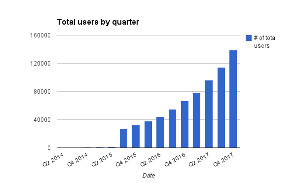
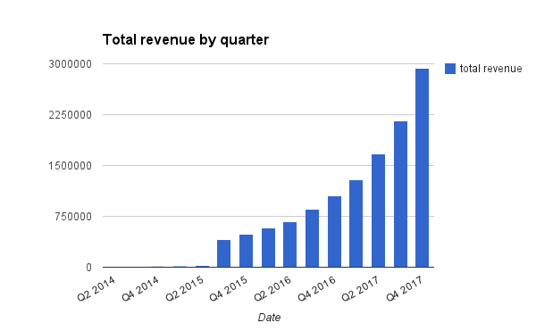

## Passive data.  Realtime health.
### hello@realize.pe

---

## Vision

## A world where everyone is fully in control of themselves.

---

## Everyone wants to improve their health and avoid hospital stays.  They often just don't know how.

### Patients lack:

* *Timely information.*  The process for discovering that you have an illness often involves experiencing a symptom and looking it up online.
* *Quick connections to caregivers.*  Healthcare organizations are currently unable to influence patient behavior when they aren't in the office.
* *Personalized insight.* Recovery is usually one-size-fits all, and can't adapt to the individual.

---

## How do we solve this?

* *Trend:* Patients increasingly use wearable devices to track their health
* *Trend:* Hospitals are increasingly incentivized to favor preventative and lower-cost care
* *Solution:* Leverage patient health data to increase engagement and make care more effective

---

## Product

### An open source, extensible web platform that aggregates and analyzes health data

* *Easy-to-use dashboard.*  Lets patients see their data at a glance
* *Powerful administrative tools.*  Makes it easy for hospitals and clinics to manage patients
* *Plugin architecture.*  Lets developers write plugins that pull in data from trackers, analyze it, and display it to the user
* *Full API.*  Enables mobile apps to leverage the capabilities of the platform

---

## Impacts

* Help patients by providing timely analysis and insight
* Help hospitals by enabling real-time patient monitoring and intervention
* Help developers by making it much easier to make mobile health apps

---

## Market Size

* Huge shift in healthcare policy with Affordable Care Act
    * Emphasize patient satisfaction and preventative care
    * 606 Accountable Care Organizations (ACOs) in Q4 2013 (Health Affairs)
    * 18 million insured through ACOs (Health Affairs)

* Large growth in self-tracking
    * 35 million total US self-trackers (Pew Research)

* 4.3 million preventable hospitalizations yearly in the US (CDC)
* Cost of $10,000 per hospital stay (AHRQ)

---

## Long Term

* The trend towards lowering hospital costs and increasing patient satisfaction metrics shows no sign of slowing down
    * The number of ACOs is growing by 11% per quarter
    * Medicare is moving to tie doctor bonuses to patient satisfaction

* Wearable device adoption is vastly increasing
    * Wearable device numbers are growing by more than 100% a year (Berg Insight)

---

## Business Model

* Recurring subscriptions
    * Individuals and organizations pay a per-month hosting fee

* App store model
    * We take a 30% cut of plugins sold by developers on the plugin store

---

## Team

* Vik Paruchuri, co-founder
    * http://www.linkedin.com/in/vikparuchuri
    * Winner of 3 Kaggle competitions on automated essay scoring and bond price prediction
    * Machine learning and web development at edX; created ways to assess essays and short responses at scale
    * US diplomat stationed in South America
    * B.A. in American History from the University of Maryland

* Adam Laughlin, co-founder
    * http://www.linkedin.com/in/alaughlin
    * Front-end web developer for Scratch, an MIT learning tool used by millions of students
    * Boston Quantified Self Organizer
    * Co-founded Web Analysts Without Borders at Save the Children
    * B.A. in Psychology from Hope College

---

## Milestones

* Launch with our initial partners (April 2014)
* Start our initial physician pilots (June 2014)
* Start our first hospital pilot (August 2014)
* Conclude first hospital pilot (March 2015)
* Roll out into first hospital (August 2015)

---

## Projections

